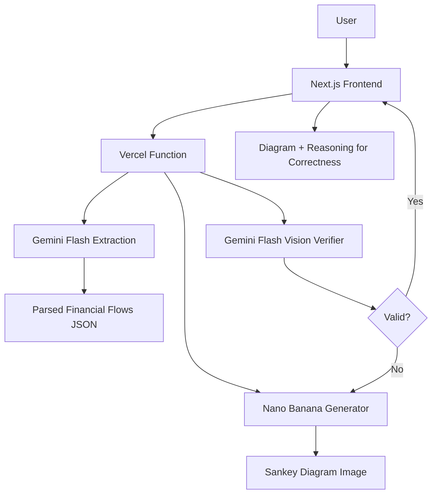
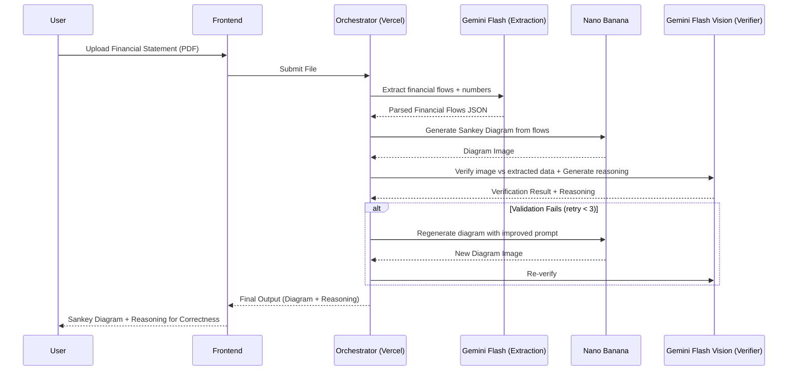
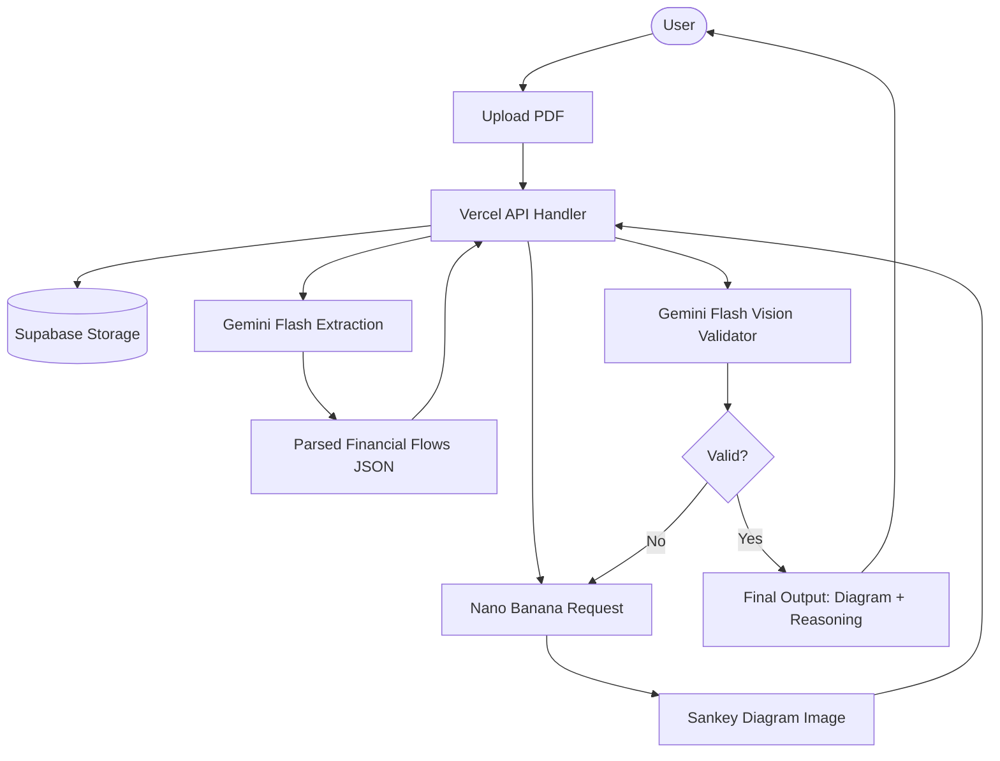

# DESIGN.md — Gemini-Optimized Architecture

## 1. Overview
This system ingests quarterly financial statements (PDF format), extracts structured financials, generates Sankey diagrams using Nano Banana, and performs strict verification with reasoning to ensure numeric accuracy. All intelligence agents run on Gemini:
- Gemini Flash → Extraction
- Nano Banana → Image Generation
- Gemini Flash Vision → Verification (with reasoning)

Nano Banana generates images directly from extracted financial data. Supervisor / orchestration remains on Vercel. Supabase handles storage and database. The system prioritizes correctness, low cost, and scalability.

## 2. Objectives
- 99%+ numeric accuracy in extraction  
- 0.1% tolerance for verification  
- Robust extraction from PDF formats  
- Regeneration until verified correctness (max 3 retries)  
- Extremely low cost (≈ $0.04–$0.06 per statement)  
- Serverless and scalable  
- Full auditability via stored JSON + logs  

## 3. Technology Stack
### Frontend
- Next.js + Vercel
- File Upload (PDF/Images)

### Backend
- Vercel Serverless Functions  
- Optional Background Functions  

### AI Agents
| Agent | Model | Role |
|-------|--------|-------|
| Extraction | Gemini Flash | OCR + Parsing + Structured Data Extraction |
| Verification | Gemini Flash Vision | Numerical validation + Reasoning generation |

### Image Generator
- Nano Banana

### Storage
- Supabase Storage for PDFs and images  
- Supabase Postgres for parsed data, specs, logs, audits  

## 4. High-Level Architecture


## 5. Sequence Diagram


## 6. Component Diagram
```mermaid
flowchart TB
    subgraph Frontend
        UI[Next.js UI]
    end
    subgraph Backend
        Orchestrator[Vercel Serverless Functions]
    end
    subgraph Gemini
        G1[Gemini Flash (Extraction)]
        G2[Gemini Flash Vision (Verification + Reasoning)]
    end
    subgraph External
        Nano[Nano Banana Generator]
    end
    subgraph Storage
        DB[(Supabase Postgres)]
        Files[(Supabase Storage)]
    end
    UI --> Orchestrator
    Orchestrator --> G1
    Orchestrator --> G2
    Orchestrator --> Nano
    Orchestrator --> DB
    Orchestrator --> Files
```

## 7. Deployment Diagram
```mermaid
flowchart LR
    subgraph Client
        Browser[User Browser]
    end
    subgraph Vercel
        Front[Next.js Frontend]
        API[Vercel Functions]
    end
    subgraph Supabase
        DB[(Postgres)]
        Storage[(File Storage)]
    end
    subgraph Google
        GeminiFlash[Gemini Flash (Extraction)]
        GeminiVision[Gemini Flash Vision (Verification + Reasoning)]
    end
    subgraph GoogleAI
        NanoB[Nano Banana (Image Generation)]
    end
    Browser --> Front
    Front --> API
    API --> GeminiFlash
    API --> GeminiVision
    API --> NanoB
    API --> DB
    API --> Storage
    Front --> Browser
```

## 8. Data Flow Diagram


## 9. Sub-Agent Specifications
### 9.1 Gemini Flash — Extraction Agent
- OCR for scanned PDFs  
- Table extraction from PDFs  
- Bottom-line validation  
- Unit normalization  
- Outputs structured JSON with financial flows:
  ```json
  {
    "flows": [
      {
        "source": "string",
        "target": "string",
        "amount": number,
        "category": "revenue" | "expense" | "asset" | "liability" | "equity"
      }
    ]
  }
  ```

### 9.2 Nano Banana — Image Generation Agent
- Receives financial flows JSON
- Formats flows into prompt for Gemini 2.5 Flash Image
- Generates Sankey diagram image (1024x1024px)
- Ensures arrow widths proportional to amounts
- Uses distinct colors for flow categories

### 9.3 Gemini Flash Vision — Verification Agent
- Reads the generated Sankey diagram image
- Extracts flow values from diagram using vision capabilities
- Compares extracted values against original financial statement data
- Detects discrepancies greater than 0.1% tolerance
- Generates reasoning for correctness including:
  - Specific value comparisons
  - Accuracy metrics
  - Explanation of why diagram is correct/incorrect  

## 10. Error Handling
- Extraction → Retry with enhanced prompt (max 2 retries)
- Diagram generation fails → Retry with improved prompt (max 3 retries)
- Verification fails → Regenerate diagram with enhanced prompt (max 3 retries total)
- All errors → Log detailed information for debugging
- Partial results → Return extracted flows even if generation/verification fails  

## 11. Cost Model
| Step | Model | Estimated Tokens | Cost |
|------|-------|------------------|------|
| Gemini Flash extraction | Gemini 2.0 Flash | ~2000 input, 500 output | $0.0002 |
| Nano Banana image | Gemini 2.5 Flash Image | 1290 tokens/image | $0.039 |
| Gemini Flash Vision verification | Gemini 2.0 Flash | ~3000 tokens | $0.0003 |
| **Total per statement** | | | **≈ $0.04** |

**Cost Breakdown:**
- Base processing: $0.04 per statement
- With retries (up to 3): $0.04–$0.12 per statement (worst case)
- Average with 1 retry: ~$0.06 per statement

## 12. Security
- Supabase RLS  
- Encrypted storage  
- Vercel edge-secured functions  
- API key isolation  

## 13. Future Enhancements
- Multi-quarter comparison  
- Automated commentary  
- Additional charts  
- SaaS-ready multi-tenant mode  
